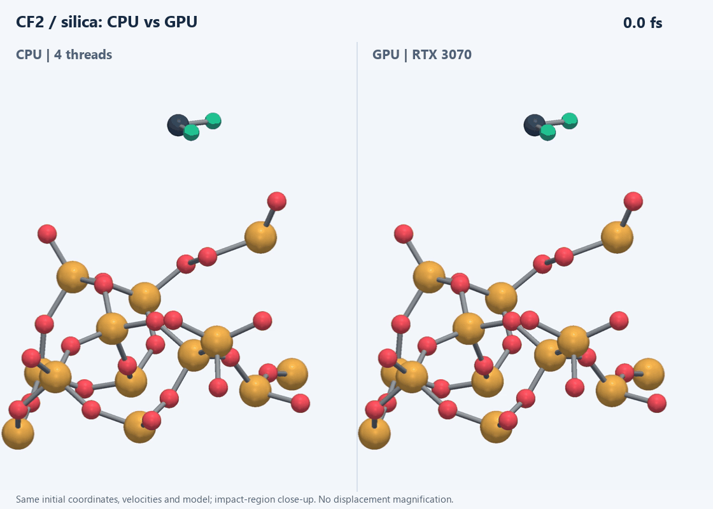
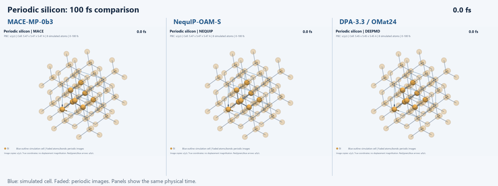

# Semiconductor MLIP benchmark

A completed small CPU pilot compares MACE-MP-0b3, NequIP-OAM-S and DeePMD DPA-3.3-1M on Si crystals, Si surfaces and SiO2/CFx etching DFT snapshots. The DPA OMol25 branch separately optimizes F2 and SiF4. Models ran sequentially in isolated environments; no training was performed.

Start with [measured results](reports/PILOT_RESULTS.md), [reproduction instructions](docs/RUN_PILOT.md), [published performance and limitations](docs/PUBLISHED_BASELINES.md), and [development notes](docs/DEVELOPMENT.md). [Model identities](docs/MODELS.md) distinguish architectures, checkpoints and dataset heads.

## Surface-interface and crystal MD

A **50 fs neutral CF2 impact on silica** (153 atoms, 30 eV, DeePMD DPA-3.3/OMat24, CPU and CUDA) and **100 fs Si crystal trajectories** for MACE, NequIP and DeePMD are saved in [short MD results](results/short-md/README.md), with actual trajectories, energy logs, manifests and animations. These are exploratory short runs; the impact uses a cold, unrelaxed slab with a fixed bottom and does not establish etch yields or plasma accuracy.

[CPU/GPU comparison](results/short-md/CPU_GPU.md) / [GPU animation](results/short-md/interface-gpu/animation.gif).



The side-by-side interface animation compares CPU and GPU at identical physical timestamps. ASE/PyVista ball-and-stick renderings use actual atom coordinates; the full-size videos include both the whole slab and the impact close-up. Bond lines are distance-based visual guides, not chemical reaction assignments. Colors: Si gold, O red, C gray, F green. [Side-by-side MP4](results/short-md/interface_comparison.mp4) / [CPU MP4 video](results/short-md/interface/animation.mp4) / [GPU MP4 video](results/short-md/interface-gpu/animation.mp4) / [Visualization details](docs/VISUALIZATION.md).

[Initial structure](results/short-md/interface/initial.png) / [Final structure](results/short-md/interface/final.png) / [Energy diagnostics](results/short-md/energy_conservation.png).



[Crystal comparison MP4](results/short-md/crystal_comparison.mp4). The three panels show the same physical timestamp. Crystal display: eight simulated atoms with 2x2x2 periodic copies, without magnifying displacements. [NequIP animation](results/short-md/nequip/animation.gif) / [DeePMD animation](results/short-md/deepmd/animation.gif).

The pilot contains four crystal, two surface and six etching frames per materials model, plus a two-atom Si equation of state. Snapshot force accuracy is measured against archived DFT labels. Equation-of-state values are predictions without matched DFT property validation. These small samples do not establish production plasma accuracy, etch rates or a general model ranking.

Native Windows CPU inference succeeded with separate Python 3.11.14 environments. Tested package snapshots are in `environments/`; CUDA inference is also tested for the DeePMD surface-impact case on an RTX 3070 Laptop GPU. Raw predictions, manifests, checkpoint/data hashes and optimization trajectories are under `results/`. The compact `results/short-md/` collection is committed to Git. Other raw benchmark results, downloaded data, weights and environments remain local and need separate transfer or regeneration.

The pinned, unmodified CHIPS-FF repository at `upstream/chipsff` supports the broader research plan. The measured pilot uses direct ASE adapters in `scripts/run_pilot.py`, not CHIPS-FF. Original `configs/`, `model_configs/`, `smoke_model.py` and `requirements-mace.txt` are earlier scaffolds, not the executed pilot environment specification.

```powershell
python -m unittest discover -s tests -v
python scripts/report_pilot.py
```

See [broader research design](docs/RESEARCH_PLAN.md) and [initial repository sources](docs/SOURCES.md). Preserve upstream code, data and checkpoint attribution and license terms.
