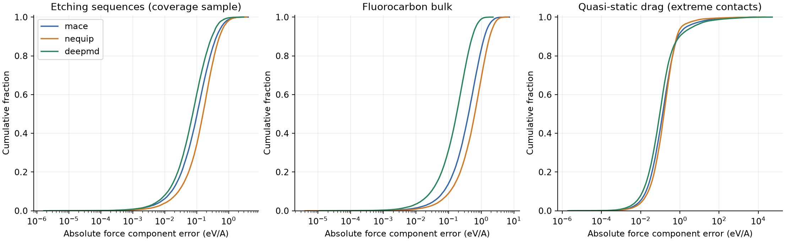
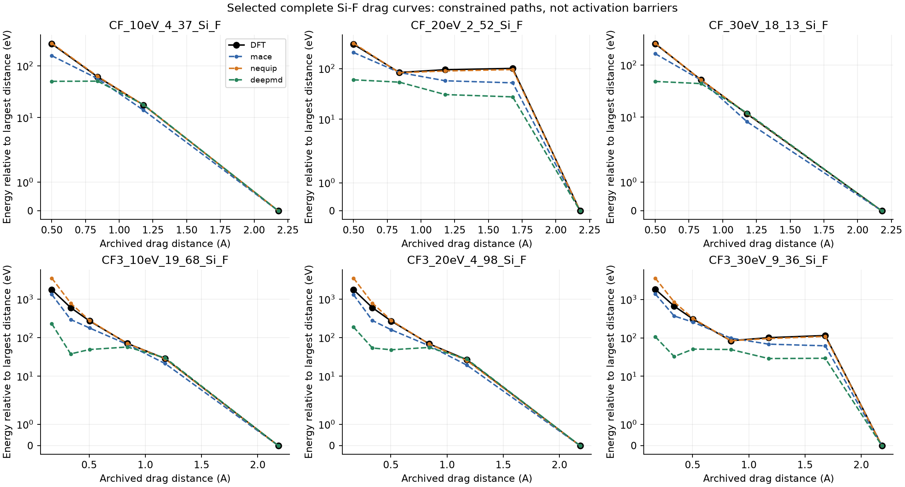
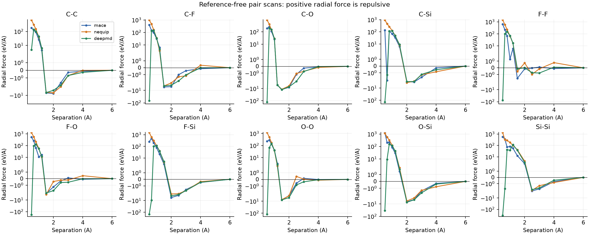

# Reactive reliability benchmark

MACE-MP-0b3 medium, NequIP-OAM-S 0.1 and DPA-3.3-1M/OMat24 evaluated on one frozen selection from the authors' DFT archive. No training, energy-offset fitting, or new MD was performed.

Source: [SevenNet-Nano supporting DFT archive](https://zenodo.org/records/19491140). The archive README identifies etching single points, fluorocarbon bulk, melt-quench-anneal bulk, and quasi-static drag series. Pretraining overlap and exact DFT dispersion treatment remain unresolved.

## Coverage and failures

| Archive member | Available | Coverage sample | Including targeted outliers |
|---|---:|---:|---:|
| dft/FC/CF0.2_d2.3.extxyz | 215 | 24 | 24 |
| dft/FC/CF0.2_d3.2.extxyz | 215 | 24 | 24 |
| dft/FC/CF0.4_d2.3.extxyz | 215 | 24 | 24 |
| dft/FC/CF0.4_d3.2.extxyz | 215 | 24 | 24 |
| dft/etch/trj_CF2_30eV.extxyz | 1000 | 32 | 47 |
| dft/etch/trj_CF3_30eV.extxyz | 1000 | 32 | 32 |
| dft/mqa/mqa_Si.extxyz | 620 | 8 | 8 |
| dft/mqa/mqa_SiC.extxyz | 620 | 8 | 8 |
| dft/mqa/mqa_SiO2.extxyz | 720 | 8 | 8 |
| dft/qsd/qsd_data.extxyz | 1343 | 249 | 249 |

448 reference frames per model; 448 succeeded in all three models. Metrics below use the common successful coverage frames. Additional frames chosen from previous worst errors are excluded from coverage aggregates and retained in the outlier tables.

| Model | Reference successes / attempted | Physical checks successful / attempted |
|---|---:|---:|
| mace | 448/448 | 114/114 |
| nequip | 448/448 | 114/114 |
| deepmd | 448/448 | 114/114 |

A successful check means it produced finite results, not that the model passed a physical acceptance threshold. Failed evaluations remain in the denominators and [failure table](failures.csv).

## Force errors against DFT

All errors below are Cartesian component errors in eV/Angstrom, pooled over atoms within each track. The maximum is a component maximum, not a vector norm. QSD contains deliberately extreme close contacts; its error scale must be read together with distance and reference-force magnitude.

| Track | Model | Frames | MAE | RMSE | P95 | P99 | Maximum |
|---|---|---:|---:|---:|---:|---:|---:|
| FC | deepmd | 96 | 0.2403 | 0.3273 | 0.6884 | 1.011 | 2.312 |
| FC | mace | 96 | 0.5688 | 0.7871 | 1.626 | 2.512 | 7.331 |
| FC | nequip | 96 | 0.8368 | 1.115 | 2.329 | 3.328 | 6.726 |
| etch | deepmd | 64 | 0.1268 | 0.2033 | 0.415 | 0.7526 | 2.995 |
| etch | mace | 64 | 0.1773 | 0.2864 | 0.6006 | 1.085 | 4.122 |
| etch | nequip | 64 | 0.2325 | 0.3414 | 0.7079 | 1.198 | 3.759 |
| mqa | deepmd | 24 | 0.1051 | 0.1525 | 0.3297 | 0.5065 | 1.005 |
| mqa | mace | 24 | 0.2057 | 0.3272 | 0.7526 | 1.198 | 2.345 |
| mqa | nequip | 24 | 0.3074 | 0.4397 | 0.9416 | 1.469 | 3.14 |
| qsd | deepmd | 249 | 23.67 | 517.1 | 4.753 | 163.9 | 5.197e+04 |
| qsd | mace | 249 | 10.17 | 153.4 | 2.212 | 52.15 | 7470 |
| qsd | nequip | 249 | 8.962 | 286.8 | 1.221 | 14.57 | 2.263e+04 |

[Per-element, chemical-subset and nearest-distance metrics](stratified_forces.csv) / [per-source-group metrics](source_groups.csv) / [per-frame metrics](frame_metrics.csv).

## Quasi-static drag: reference-backed short-range response

Each selected curve is complete. Energies are differenced from the largest-distance frame in that same curve. This cancels a constant energy zero without fitting test labels. Slopes compare adjacent distance points; DFT energy changes below 1e-6 eV are excluded. These are constrained-path energy differences, not reaction activation barriers.

| Model | Complete curves | Mean curve relative-energy MAE (eV) | Wrong/zero slope signs / comparisons |
|---|---:|---:|---:|
| mace | 48 | 140.1 | 5/201 |
| nequip | 48 | 58.63 | 0/201 |
| deepmd | 48 | 223.2 | 49/201 |

Reference quality: 249 selected QSD frames lack a DFT-convergence flag. This does not prove unconverged DFT, but finite labels alone do not independently establish reference quality at extreme overlaps. See the [reference audit](reference_audit.json).

[Every curve and its energy span](qsd_curves.csv). Equal curve weighting is descriptive; related curves share source events and are not independent replicates.

## Largest etching force errors

These include deliberately selected prior outliers. Atom indices are zero-based within the archived frame. C/F and Si/O labels indicate chemical composition only; projectile provenance is unavailable.

| Model | Frame | Atom / element | Vector error (eV/A) | Reference force norm (eV/A) | Nearest distance (A) |
|---|---|---|---:|---:|---:|
| mace | trj_CF2_30eV.extxyz:958 | 2 / C | 9.217 | 58.73 | 0.921 |
| mace | trj_CF2_30eV.extxyz:958 | 105 / O | 9.214 | 58.73 | 0.921 |
| mace | trj_CF2_30eV.extxyz:339 | 27 / F | 9.129 | 19.22 | 1.370 |
| nequip | trj_CF2_30eV.extxyz:232 | 23 / F | 8.322 | 10.42 | 1.504 |
| nequip | trj_CF2_30eV.extxyz:874 | 4 / F | 8.084 | 9.329 | 1.365 |
| nequip | trj_CF2_30eV.extxyz:292 | 14 / F | 7.736 | 11.24 | 1.898 |
| deepmd | trj_CF2_30eV.extxyz:232 | 23 / F | 9.003 | 10.42 | 1.504 |
| deepmd | trj_CF2_30eV.extxyz:874 | 4 / F | 8.198 | 9.329 | 1.365 |
| deepmd | trj_CF2_30eV.extxyz:292 | 14 / F | 7.361 | 11.24 | 1.898 |

[Worst atoms across all tracks](worst_atoms.csv) includes the top three atoms per frame. Three worst etching frames per model are exported with reference/predicted forces: [MACE](worst_etch_mace.extxyz), [NequIP](worst_etch_nequip.extxyz), [DeePMD](worst_etch_deepmd.extxyz).

## Reference-free physical diagnostics

Ten unordered Si/O/C/F pairs, eleven separations from 0.5 to 6 A, nonperiodic. Positive force on the right-hand atom indicates repulsion. Finite differences use two step sizes (0.001 and 0.0005 A) at 0.8, 1.5 and 3 A. Short-range attraction is flagged for inspection; there are no DFT dimer labels here. Precision-dependent residuals are reported without a universal pass threshold.

| Model | Attractive samples at r <= 0.65 A | Max finite-difference force residual (eV/A) | Max rotation force residual (eV/A) |
|---|---:|---:|---:|
| mace | 1/20 | 0.004432 | 1.004e-13 |
| nequip | 0/20 | 0.04038 | 7.856e-06 |
| deepmd | 12/20 | 0.04794 | 5.874e-05 |

A [targeted CPU/GPU reproduction](deepmd_cpu_gpu_spotcheck.json) checks C-F and Si-Si pairs at 0.5/0.65 A and the three worst DeePMD QSD frames. The maximum CPU/GPU component difference on those QSD frames is 181 eV/A. The very close contacts are numerically sensitive; the saved file also reports CPU and GPU errors against DFT. This is not a general device-equivalence test.

[Full physical checks](physical_checks.csv) include translation, rotation, permutation and net pair forces.

## Statistical interpretation and remaining work

- The selected QSD curves span CF/CF3 labels at 10/20/30 eV and available ordered contact pairs. Those labels describe source conditions; QSD is not an impact trajectory at those energies.
- CF2 and CF3 provide two etching sequences at 30 eV; they are not proven independent replicas. Bulk conditions broaden chemistry and temperature-history coverage, not etching-yield validation.
- The plan stores source groups to prevent future random frame splits. No train/test claim or confidence interval is made because source independence and pretraining overlap are unresolved.
- Reaction barriers, adsorption/desorption energies, independent impact replicas and new matched DFT references remain future work. No neutral MLIP plasma-charge or stopping accuracy is inferred.
- Runtime here includes diagnostics, initialization and mixed checkpoint precisions; it is not a speed ranking.

## Reproduction

[Execution instructions](../../docs/RELIABILITY.md). Raw arrays and structures remain under `results/reliability/<backend>/predictions.jsonl`; [provenance](provenance.json) includes model manifests, checkpoint hashes, actual devices/precisions and input/output hashes. Compact tables and plots are in this directory.
