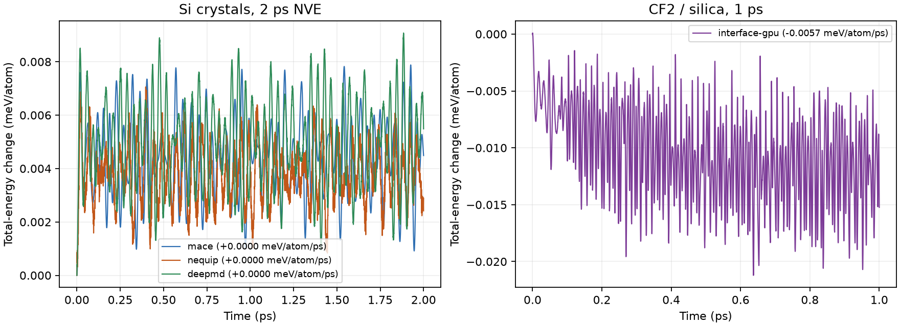
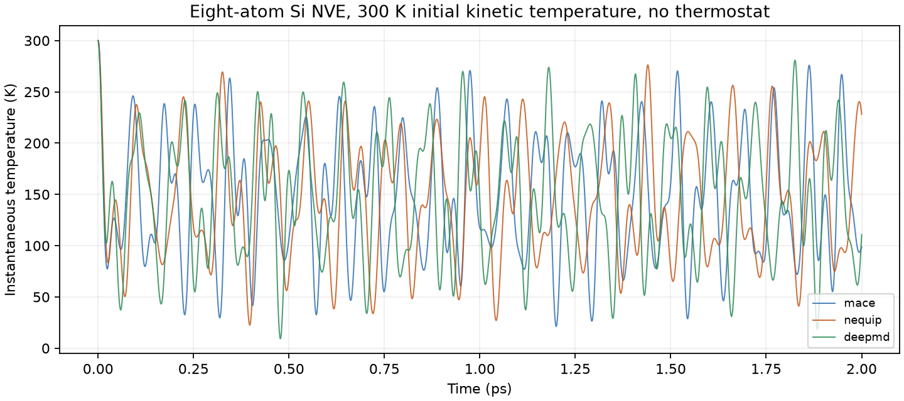
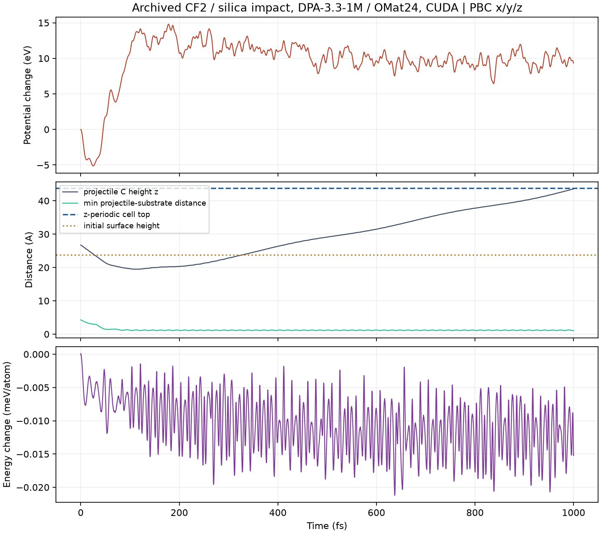
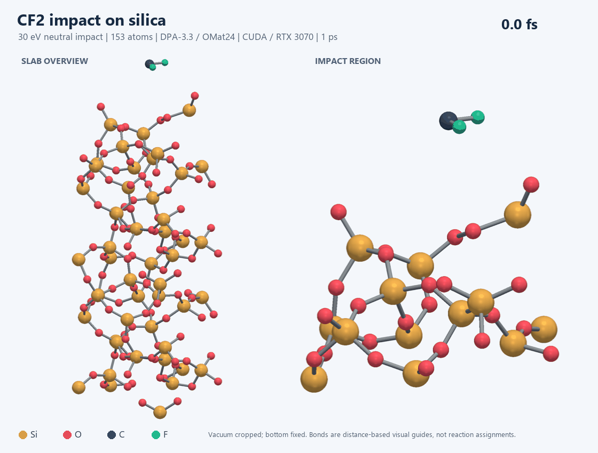
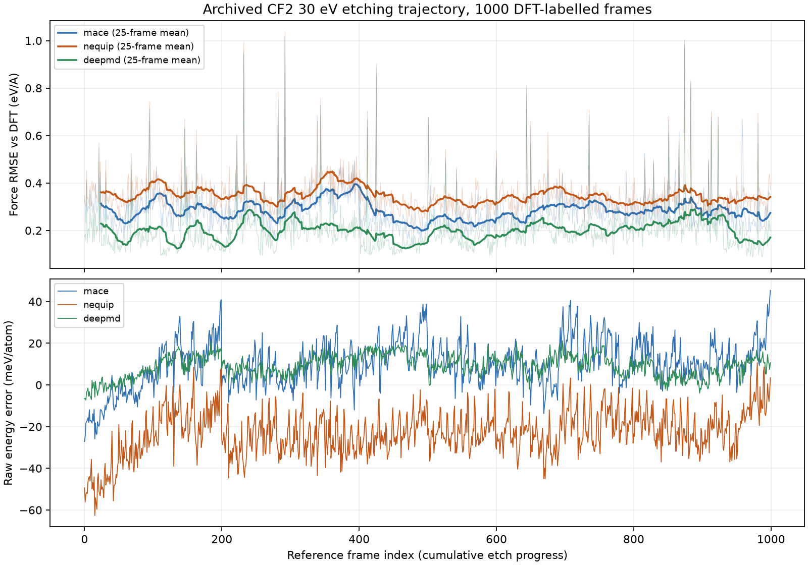
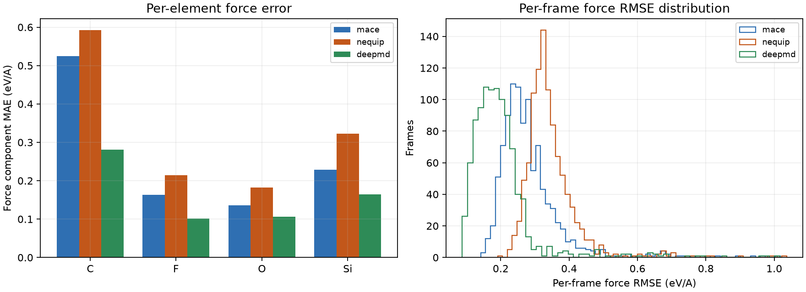

# Longer trajectories and full-reference-trajectory validation

For the current PBC-aware movies, see the [visualization guide](../../docs/VISUALIZATION.md) and [extended 2 ps impact event](interface-event-gpu/README.md). The runs below remain archived results.

Two measurements were added to the earlier short pilot: molecular dynamics runs twenty times longer than the committed short ones, and single points against every archived DFT frame of one etching reference trajectory instead of six sampled frames. No model was trained or fine-tuned.

## Longer molecular dynamics

| Run | Model | Device | Atoms | Time (ps) | Step (fs) | Max energy change (meV/atom) | Drift slope (meV/atom/ps) | Wall (s) |
|---|---|---|---:|---:|---:|---:|---:|---:|
| mace | MACE-MP-0b3 medium | cpu | 8 | 2 | 0.5 | 0.00788 | +0.00003 | 598.6 |
| nequip | NequIP-OAM-S 0.1 | cpu | 8 | 2 | 0.5 | 0.00706 | +0.00001 | 41.5 |
| deepmd | DPA-3.3-1M / OMat24 | cpu | 8 | 2 | 0.5 | 0.00908 | +0.00005 | 313.0 |
| interface-gpu | DPA-3.3-1M / OMat24 | cuda | 153 | 1 | 0.25 | 0.02121 | -0.00573 | 433.2 |



The drift slope is a least-squares fit of the total-energy change against time. It is a single unthermostatted run per system, so it measures integrator and model smoothness over this window, not ensemble-averaged conservation.

### Si crystal runs

Eight-atom periodic diamond cells, 2 ps NVE with the same 300 K initial velocity seed, model-specific equation-of-state lattice constants and no thermostat or equilibration. Instantaneous temperature oscillates because an eight-atom microcanonical cell exchanges kinetic and potential energy; these are not converged thermal averages.

| Model | Final temperature (K) | Mean temperature (K) | Std. dev. (K) |
|---|---:|---:|---:|
| MACE-MP-0b3 medium | 98.7 | 148.4 | 58.1 |
| NequIP-OAM-S 0.1 | 228.1 | 147.2 | 56.6 |
| DPA-3.3-1M / OMat24 | 110.8 | 148.8 | 59.5 |



### CF2 / silica impact

The constructed 30 eV neutral CF2 impact was extended to 1000 fs (4000 steps of 0.25 fs) on CUDA, from the same initial coordinates, velocities and checkpoint as the committed 50 fs run. All caveats of that run still apply: cold unrelaxed substrate, frozen bottom layer, retained periodic vacuum, no charge state and no thermostat.

Minimum distance between an original projectile atom and the substrate over the run: 1.054 A. That minimum is taken over all three original projectile atoms, so it stays near its floor for the whole run even after the carbon leaves the surface region, because the two fluorines do not.

The projectile carbon starts at z = 26.74 A, above a substrate whose highest atom is at 23.74 A. It reaches its lowest point, 19.49 A, at 112.75 fs, about 4.25 A below that initial surface height, then reverses and rises to 43.57 A by the end of the run. Its nearest neighbour in the final frame is a substrate O atom at 1.088 A, and the two original fluorine atoms remain at z = 20.56 and 21.43 A. These are measured distances; no bond, desorption product or reaction channel is assigned from them.

This also bounds the usable run length. The carbon is still moving upward at 0.038 A/fs at 1000 fs and the retained periodic cell ends at 43.74 A, so it would cross the top boundary and re-enter from below roughly 5 fs later. Running this cell materially longer would need added vacuum or a different boundary treatment.





Atom identity is tracked through the trajectory; no bond breaking, sputter yield or reaction product is assigned. One trajectory cannot establish an etch yield.

## Ground-truth comparison against the reference DFT trajectory

Each checkpoint was evaluated on all 1000 archived DFT frames of `dft/etch/trj_CF2_30eV.extxyz`, sequentially on CPU. These are the authors' DFT single points on snapshots generated by a different model (7net-Omni), ordered by cumulative etch progress. Consecutive frames are separate impact snapshots with changing composition, not adjacent MD steps, so this measures label accuracy along the reference chemistry rather than dynamical agreement.

| Checkpoint | Force MAE (eV/A) | Force RMSE (eV/A) | Raw energy MAE (meV/atom) | Offset-fitted energy MAE (meV/atom) | Median s/frame |
|---|---:|---:|---:|---:|---:|
| MACE-MP-0b3 medium | 0.1743 | 0.2994 | 12.16 | 6.71 | 2.4501 |
| NequIP-OAM-S 0.1 | 0.2359 | 0.3566 | 23.23 | 7.87 | 0.0410 |
| DPA-3.3-1M / OMat24 | 0.1255 | 0.2217 | 9.37 | 2.94 | 1.4159 |

Force errors pool every Cartesian component of every frame. The raw energy column has no fitted offset and therefore still contains reference-convention and energy-zero differences. The offset-fitted column removes one least-squares energy per element, fitted on these same frames; it is a diagnostic of shape agreement, not an independently validated formation energy, and it cannot be used as a held-out accuracy estimate.



| Checkpoint | C force MAE (eV/A) | F force MAE (eV/A) | O force MAE (eV/A) | Si force MAE (eV/A) |
|---|---:|---:|---:|---:|
| MACE-MP-0b3 medium | 0.5252 | 0.1637 | 0.1363 | 0.2281 |
| NequIP-OAM-S 0.1 | 0.5925 | 0.2144 | 0.1826 | 0.3227 |
| DPA-3.3-1M / OMat24 | 0.2815 | 0.1017 | 0.1058 | 0.1640 |



Per-frame metrics are in `../validation-etch/<backend>/frames.csv`; pooled metrics are in `../../reports/etch_validation_metrics.csv`. The six-frame subset of the earlier pilot is a subset of these frames, so the two reports are consistent but not independent.

## Limitations

- One trajectory per system and one reference etch sequence; no repeats, no error bars.
- The reference labels come from one DFT setup whose exact dispersion treatment is still unconfirmed; see [published baselines](../../docs/PUBLISHED_BASELINES.md).
- Snapshot accuracy on an externally generated trajectory does not establish that any of these models would generate the same trajectory, nor an etch rate, yield or selectivity.
- Wall times include per-frame overheads and are not matched-precision throughput measurements.
- The interface cell keeps its original periodic vacuum, so the run ends just before the rising projectile would wrap through the top boundary; this is a run-length limit, not a converged result.

## Reproduction

Run from the repository root; output folders must not already exist.

```powershell
.venv-deepmd-gpu/Scripts/python.exe scripts/run_interface_md.py --device cuda --output results/long-md/interface-gpu --steps 4000 --timestep-fs 0.25 --record-every 20
.venv-mace/Scripts/python.exe scripts/run_short_md.py --backend mace --output results/long-md/mace --steps 4000 --timestep-fs 0.5 --record-every 20
.venv-nequip/Scripts/python.exe scripts/run_short_md.py --backend nequip --output results/long-md/nequip --steps 4000 --timestep-fs 0.5 --record-every 20
.venv-deepmd/Scripts/python.exe scripts/run_short_md.py --backend deepmd --output results/long-md/deepmd --steps 4000 --timestep-fs 0.5 --record-every 20
.venv-mace/Scripts/python.exe scripts/validate_reference_trajectory.py --backend mace --output results/validation-etch/mace
.venv-nequip/Scripts/python.exe scripts/validate_reference_trajectory.py --backend nequip --output results/validation-etch/nequip
.venv-deepmd/Scripts/python.exe scripts/validate_reference_trajectory.py --backend deepmd --output results/validation-etch/deepmd
.venv-render/Scripts/python.exe scripts/render_atomistic.py --root results/long-md --names interface-gpu --stride 4
.venv-render/Scripts/python.exe scripts/report_long_md.py
```

The reference archive is the [etching dataset](https://zenodo.org/records/19491140); its SHA-256 and each checkpoint hash are recorded in the manifests next to every result.
