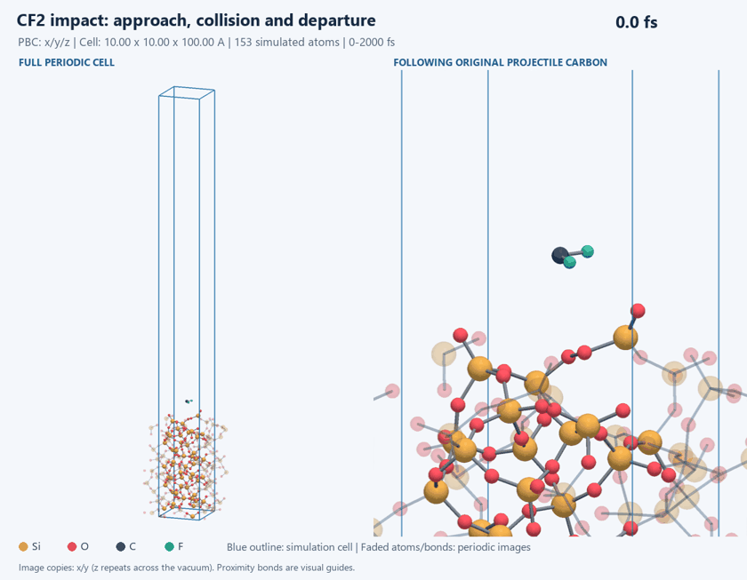
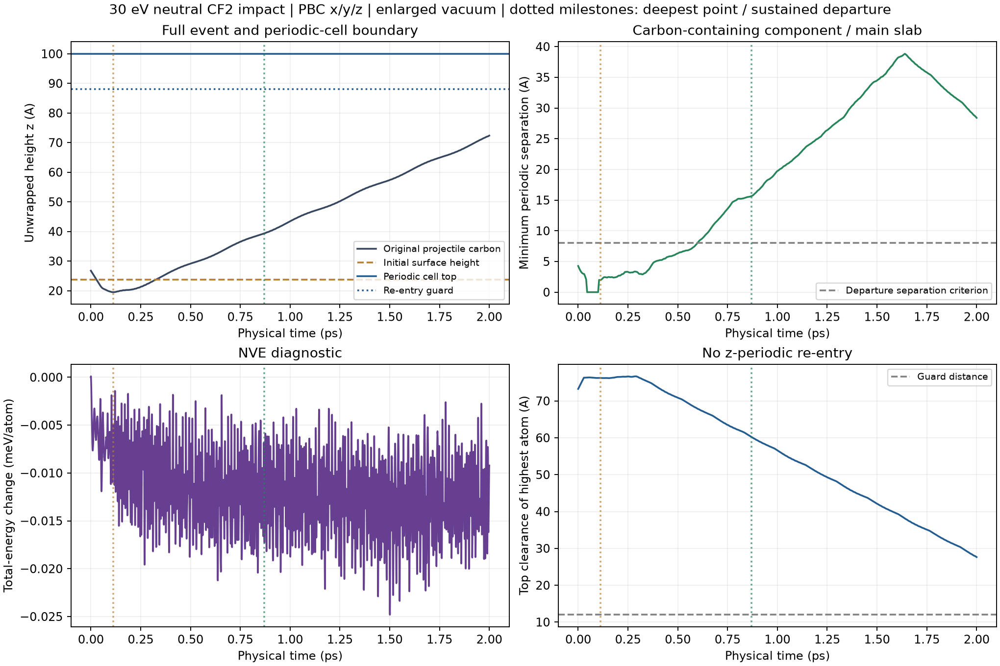

# Extended impact with explicit periodic boundaries

The impact runs for **2 ps**, compared with the earlier 50 fs preview. The cell is 10 x 10 x 100 A with PBC in x/y/z. It starts from the earlier saved initial positions and velocities; only the vacuum height changes.



[Full-size MP4](animation.mp4) / [final view](final.png) / [event measurements](event_summary.json)

The carbon reaches its deepest point at **112.75 fs**, 4.25 A below the initial surface. Its final height is 72.37 A. The minimum top clearance throughout the run is 27.63 A against a 12 A guard.

**Sustained departure is confirmed at 870 fs** and remains satisfied through 2000 fs.

Carbon-containing proximity component >=8 A from largest slab component, component center of mass >10 A above initial surface and moving outward, sustained for >=200 fs through final frame.

The separation diagnostic uses periodic minimum images. It can decrease late in the run as the departing fragment approaches the next periodic slab image, while its unwrapped height continues increasing. The boundary guard keeps it outside the next periodic image interaction range.



The left animation panel shows the entire periodic cell, including vacuum. The right panel follows the original projectile carbon. Faded image atoms and their bonds show lateral periodic continuation; the z direction repeats across the vacuum. The blue outline is the actual simulation cell, not a display supercell.

Maximum absolute total-energy change: 0.02481 meV/atom. This is a single cold, unrelaxed-slab impact with a fixed bottom and neutral ground-state MLIP. The geometric departure criterion establishes an endpoint for the primary impact/departure event; it does not establish an etch yield, chemical product identity, complete substrate relaxation, or plasma accuracy.

## Reproduction

```powershell
.venv-deepmd-gpu/Scripts/python.exe scripts/run_impact_event.py
.venv-render/Scripts/python.exe scripts/report_impact_event.py
.venv-render/Scripts/python.exe scripts/render_periodic_md.py --names interface-event-gpu
```

Output directories for new simulations must not already exist. The old 1 ps and 50 fs runs remain separate historical results.
