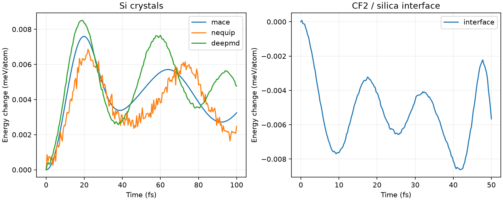

# Short molecular dynamics results

Three crystal checks and one surface-interface trajectory were run sequentially on CPU. These are short numerical/visual demonstrations, not equilibrium sampling or validated etching predictions.

| System | Model | Atoms | Time (fs) | Step (fs) | Max absolute energy change (meV/atom) |
|---|---|---:|---:|---:|---:|
| mace | MACE-MP-0b3 medium | 8 | 100 | 0.5 | 0.00759 |
| nequip | NequIP-OAM-S 0.1 | 8 | 100 | 0.5 | 0.00687 |
| deepmd | DPA-3.3-1M / OMat24 | 8 | 100 | 0.5 | 0.00851 |
| interface | DPA-3.3-1M / OMat24 | 153 | 50 | 0.25 | 0.00862 |

[Matched CPU/GPU comparison and GPU animation](CPU_GPU.md)

Twenty-times-longer runs of these same systems, and a comparison against every archived DFT frame of the etching reference trajectory, are in [the longer-trajectory report](../long-md/README.md).

## Surface-interface trajectory

A constructed neutral CF2 projectile starts 3 Å above the archived silica slab, with 30 eV translational energy toward the surface. The substrate initially has zero velocity and is not relaxed; atoms within 2 Å of its bottom are frozen. Original periodic boundaries and vacuum are retained. CF2 starts at 1.3 Å C–F distance and 105° F–C–F angle. This is a new constructed impact, not a continuation with the original dataset velocities.

Minimum distance between an original projectile atom and substrate during this trajectory: 1.474 Å. Atom identity is tracked even if bonding changes; no etch yield or reaction assignment is inferred.


## Crystal trajectories

Eight-atom periodic diamond Si cells use each model’s earlier EOS lattice prediction, the same random seed, 300 K initial kinetic temperature, and removed center-of-mass motion. No thermostat or equilibration is applied. ASE temperature uses its 3N convention. Visualizations repeat the simulated cell 2×2×2 without magnifying motion.


[NequIP animation](nequip/animation.gif) · [DeePMD animation](deepmd/animation.gif)

## Numerical diagnostics and reproduction



Each subfolder includes the actual saved trajectory (`trajectory.extxyz`), per-step energy CSV, manifest, initial/final PNGs and GIF. Energy changes are relative to the first recorded step, not fitted slopes. Crystal wall times include loading and cannot establish a speed ranking.

Integration uses [ASE Velocity Verlet](https://docs.ase-lib.org/_modules/ase/md/verlet.html). The surface reference is from the [etching dataset](https://zenodo.org/records/19491140); archive and checkpoint hashes are recorded in the manifest. Short-range, timestep, cell-size and charge-state validation remain necessary for quantitative interface predictions. OMol25 is not applied to periodic surfaces.

Run from the repository root with the existing isolated environments, in this order (output folders must not already exist):

```powershell
.venv-mace/Scripts/python.exe scripts/run_short_md.py --backend mace --output results/short-md/mace
.venv-nequip/Scripts/python.exe scripts/run_short_md.py --backend nequip --output results/short-md/nequip
.venv-deepmd/Scripts/python.exe scripts/run_short_md.py --backend deepmd --output results/short-md/deepmd
.venv-deepmd/Scripts/python.exe scripts/run_interface_md.py
.venv-render/Scripts/python.exe scripts/render_md.py
```

Rendering uses ASE + PyVista/VTK. See [visualization setup and conventions](../../docs/VISUALIZATION.md). MP4 videos are available next to each GIF.
